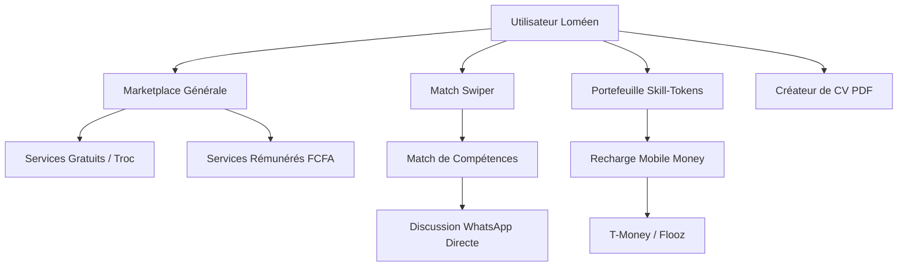

# 🌟 SKILL-TRADE LOMÉ — Dossier de Présentation & de Défense du Projet

> **Plateforme innovante de troc de compétences et de services pour les jeunes talents de Lomé et du Togo.**

---

## 📋 Table des Matières
1. 💡 [Vision & Genèse du Projet](#-vision--genese-du-projet)
2. 🎯 [La Problématique & Notre Solution](#-la-problematique--notre-solution)
3. 🛠️ [Fonctionnalités Majeures (L'Écosystème)](#%EF%B8%8F-fonctionnalites-majeures-lecosysteme)
4. 💎 [Modèle Économique (Monétisation & Viabilité)](#-modele-economique-monetisation--viabilite)
5. 💻 [Architecture Technique & Premium Design](#-architecture-technique--premium-design)
6. 🚀 [Arguments Clés pour Convaincre (Défense du Projet)](#-arguments-cles-pour-convaincre-defense-du-projet)

---

## 💡 Vision & Genèse du Projet

À Lomé, la jeunesse regorge de talents créatifs, de développeurs, de designers, de rédacteurs et de professionnels manuels. Cependant, deux obstacles majeurs freinent leur expansion :
1. **La barrière financière** : Le manque de capitaux de départ pour s'offrir des services professionnels indispensables (logo, site web, relecture, stratégie marketing).
2. **Le manque de visibilité** : Des compétences incroyables restent sous-utilisées faute de plateformes d'exposition modernes et adaptées aux réalités locales.

**Skill-Trade** est né pour briser ces barrières. Notre vision est de créer un **écosystème collaboratif et circulaire** où le temps et le talent remplacent l'argent traditionnel, tout en offrant des passerelles de monétisation réelles grâce aux technologies de paiement mobile locales (T-Money, Flooz).

---

## 🎯 La Problématique & Notre Solution

### Le Problème
* Les jeunes entrepreneurs ou freelances n'ont pas les moyens de payer un développeur pour leur site web.
* Le développeur, de son côté, a besoin d'un logo ou d'un montage vidéo mais n'a pas le budget pour rémunérer un designer.
* Les transactions traditionnelles échouent par manque de liquidités (FCFA).

### La Solution Skill-Trade
* **Le Troc Intelligent** : Le développeur crée le site web du designer en échange du logo. Valeur nette dépensée : **0 FCFA**. Valeur nette créée : **Deux business lancés !**
* **La Monétisation Hybride** : Pour les services à plus forte valeur ou nécessitant un complément, l'utilisateur peut proposer une rémunération directe en **FCFA** ou utiliser des **Skill-Tokens** (la monnaie interne).
* **Le Matchmaking Ludique** : Inspiré des meilleures applications de rencontre, notre système de swipe permet de faire matcher instantanément les besoins et les offres de deux utilisateurs.

---

## 🛠️ Fonctionnalités Majeures (L'Écosystème)

L'application a été développée avec des standards de qualité premium, combinant fluidité technique et esthétique moderne.

### 1. La Marketplace Dynamique & Intelligente
* Regroupe tous les services proposés à Lomé, divisés en deux grandes catégories : **Compétences Tech & Design** et **Services de Temps & Manuels**.
* Barre de recherche ultra-rapide avec filtres dynamiques par mots-clés, catégories et types d'offres.
* Les services créés par les utilisateurs réels sont intégrés instantanément au flux de la communauté.

### 2. Le Match Swiper (Troc de talents)
* Interface dynamique permettant de faire défiler des profils de talents locaux.
* Algorithme de compatibilité calculé selon les compétences recherchées et proposées.
* En cas de "Match", les utilisateurs sont mis en relation et peuvent discuter directement par **WhatsApp** pour concrétiser leur troc.

### 3. Le Portefeuille & Simulateur Mobile Money
* Gestion des **Skill-Tokens** pour les transactions fluides au sein de l'application.
* Intégration d'un simulateur de paiement mobile 100% adapté au marché togolais, supportant **T-Money** et **Flooz**.
* Transactions instantanées sécurisées par jetons d'authentification.

### 4. Le Générateur de CV & Import PDF
* Section dédiée permettant à chaque jeune de construire un CV professionnel en quelques clics (informations personnelles, compétences, expériences, parcours académique).
* Possibilité d'importer son propre fichier **PDF** pour l'exposer publiquement sur son profil Skill-Trade.

### 5. Les Paramètres Globaux (Sombre/Clair & Multilangue)
* Toggle de thème (Clair/Sombre) persistant en base de données et par cookies pour une expérience visuelle optimale.
* Traduction intégrale de la plateforme en deux langues : **Français** (par défaut) et **Anglais** (pour l'ouverture internationale).

---

## 💎 Modèle Économique (Monétisation & Viabilité)

Pour que vous (l'éditeur de la plateforme) puissiez gagner de l'argent et rentabiliser ce projet, nous avons mis en place une structure **Freemium** très attractive et non intrusive.

| Caractéristiques | Plan GRATUIT | Plan PRO (1 000 FCFA/mois) | Plan BUSINESS (3 000 FCFA/mois) |
| :--- | :---: | :---: | :---: |
| **Limite de services** | 1 service maximum | Jusqu'à 10 services simultanés | **Services illimités** |
| **Monétisation** | Troc uniquement (0 FCFA) | **Services rémunérés en FCFA** | **Services rémunérés en FCFA** |
| **Visibilité** | Standard | Badge Pro + Priorité | **Spotlight Premium** (Top de page) |
| **Support** | Standard | Prioritaire | Support Dédié 24h/7d |
| **Cible** | Débutants, Curieux | Freelances confirmés | Agences, PME locales |

### Pourquoi ce modèle fonctionne ?
1. **L'appel du gratuit** : N'importe quel jeune de Lomé peut s'inscrire et échanger gratuitement. Cela crée une **croissance virale** organique rapide.
2. **La frustration positive** : Dès qu'un utilisateur veut proposer un deuxième service ou souhaite gagner de l'argent réel en FCFA, il est naturellement incité à passer au plan **Pro** pour seulement **1 000 FCFA** (le prix d'un crédit internet mensuel à Lomé).
3. **Le levier des entreprises** : Les petites agences locales souscrivent au plan **Business** pour saturer le marché d'offres et bénéficier d'une visibilité en tête de liste (Premium Spotlight).

---

## 💻 Architecture Technique & Premium Design

La plateforme utilise le fleuron des technologies web modernes pour assurer des performances exceptionnelles, même avec les connexions mobiles limitées de Lomé :

* **Framework** : Next.js (App Router, Server Components & React 19) pour des temps de chargement instantanés et un excellent référencement SEO.
* **Base de données** : SQLite gérée par le puissant ORM Prisma pour des requêtes relationnelles ultra-robustes.
* **Sécurité & Sessions** : Sessions chiffrées par jetons JWT (via la bibliothèque `jose`) et mots de passe hachés avec `bcryptjs`.
* **Design & Esthétique** :
  * Thème sombre futuriste avec des lueurs néon violettes et cyans (Glassmorphism).
  * Transitions CSS ultra-fluides, micro-animations au survol des cartes.
  * Menu utilisateur interactif en haut à droite avec gestion dynamique de l'avatar et de la langue.

---

## 🚀 Arguments Clés pour Convaincre (Défense du Projet)

Si vous devez présenter ce projet à des partenaires, des investisseurs ou des institutions publiques (comme le Ministère du Numérique ou de l'Emploi des Jeunes au Togo), voici les arguments imparables :

### 1. Un Impact Social Majeur (Création d'Emplois)
Skill-Trade permet à des milieux de jeunes exclus du système financier traditionnel de se créer un portfolio, de trouver leurs premiers clients, d'acquérir de l'expérience pratique et d'échanger des compétences sans débourser un seul franc. C'est un **accélérateur d'employabilité**.

### 2. Une Solution Adaptée aux Réalités Locales (Mobile Money & WhatsApp)
Contrairement aux plateformes occidentales (Fiverr, Upwork) qui nécessitent des cartes de crédit internationales ou des comptes PayPal (inaccessibles pour la majorité des jeunes Loméens), Skill-Trade s'intègre directement avec **WhatsApp** pour les discussions, et les passerelles **T-Money/Flooz** pour les transactions financières en FCFA.

### 3. Une rentabilité rapide et scalable
Avec un hébergement optimisé (Vercel + base de données cloud), les coûts d'infrastructure sont extrêmement faibles. Avec seulement **1 000 abonnés Pro**, la plateforme génère **1 000 000 FCFA de revenus récurrents par mois**, assurant une excellente rentabilité pour vous, l'éditeur de l'application.

### 4. Une Économie Circulaire Résiliente
En période de crise économique ou de manque de liquidités, le troc devient la méthode d'échange la plus résiliente. Skill-Trade numérise et modernise cette pratique ancestrale pour en faire le moteur de la tech togolaise.

---

> **Skill-Trade Lomé : Valoriser le talent local, démocratiser l'échange de compétences, et propulser la jeunesse togolaise vers le succès numérique.**
